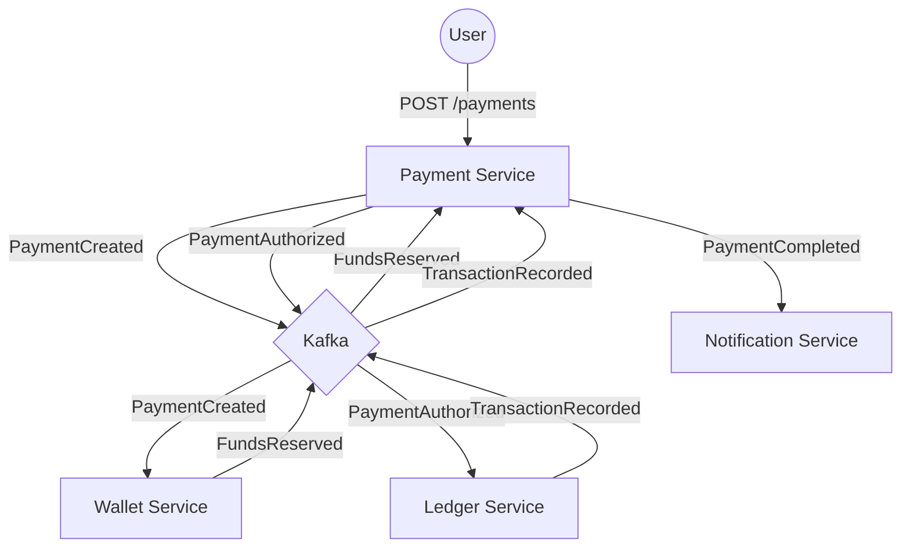

# Event Driven Payments


A distributed, event-driven Java Spring Boot microservices payment platform implementing a state machine, Kafka messaging, and Domain-Driven Design (DDD) patterns.

## Architecture

The system uses a choreography-based Saga pattern where services react to events.



## Services

-   **Payment Service**: Manages payment lifecycle and state machine (Saga Orchestrator logic via choreography).
-   **Wallet Service**: Manages user pockets, balances, and fund reservations.
-   **Ledger Service**: Immutable double-entry ledger for all financial transactions.
-   **Notification Service**: Sends emails/alerts based on payment events.

## Prerequisites

-   Java 17+
-   Docker & Docker Compose
-   Maven 3.8+

## How to Run

1.  **Clone the repository**
    ```bash
    git clone https://github.com/yourusername/event-driven-payments.git
    cd event-driven-payments
    ```

2.  **Start Infrastructure & Services**
    ```bash
    docker-compose up -d --build
    ```

3.  **Access APIs**
    -   **Payment Service**: [http://localhost:8081/swagger-ui/index.html](http://localhost:8081/swagger-ui/index.html)
    -   **Wallet Service**: [http://localhost:8082/swagger-ui/index.html](http://localhost:8082/swagger-ui/index.html)
    -   **Ledger Service**: [http://localhost:8083/swagger-ui/index.html](http://localhost:8083/swagger-ui/index.html)

## API Usage

### Create a Payment

```bash
curl -X POST http://localhost:8081/payments \
  -H "Content-Type: application/json" \
  -d '{
    "amount": 100.00,
    "currency": "USD",
    "debitorId": "user-123",
    "beneficiaryId": "merchant-456"
  }'
```

### Check Payment Status

```bash
curl http://localhost:8081/payments/{paymentId}
```
