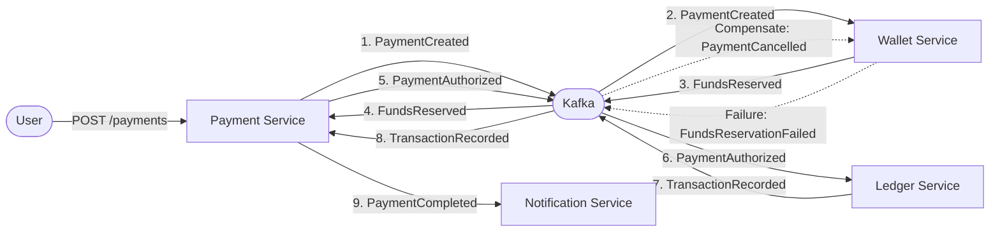

# Event Driven Payments


A distributed, event-driven Java Spring Boot microservices payment platform implementing a state machine, Kafka messaging, and Domain-Driven Design (DDD) patterns.

## Architecture

The system uses a choreography-based Saga pattern where services react to events.



## Documentation

-   [Architecture Overview](architecture.md)
-   [Payment State Machine](state-machine.md)
-   [Event Catalog](events.md)

## Services

-   **Payment Service**: Manages payment lifecycle and state machine (Saga Orchestrator logic via choreography).
-   **Wallet Service**: Manages user pockets, balances, and fund reservations.
-   **Ledger Service**: Immutable double-entry ledger for all financial transactions.
-   **Notification Service**: Sends emails/alerts based on payment events.

## Prerequisites

-   Java 17+
-   Docker & Docker Compose
-   Maven 3.8+

## How to Run

1.  **Clone the repository**
    ```bash
    git clone https://github.com/yourusername/event-driven-payments.git
    cd event-driven-payments
    ```

2.  **Start Infrastructure & Services**
    ```bash
    docker-compose up -d --build
    ```

3.  **Access APIs**
    -   **Payment Service API**: [http://localhost:8080/swagger-ui.html](http://localhost:8080/swagger-ui.html)
    -   **Wallet Service**: http://localhost:8081 (no REST API)
    -   **Ledger Service**: http://localhost:8082 (no REST API)

## Testing

To run the end-to-end regression tests (requires Docker):

```bash
docker run --rm -v "$(pwd)":/usr/src/app -w /usr/src/app/payment-service maven:3.8-openjdk-17 mvn test -Dtest=PaymentIntegrationTest
```

## Failure Handling

The system implements compensating transactions for fault tolerance.

### Insufficient Funds Scenario

**Flow:**
1. User creates payment for $100
2. Payment Service emits `PaymentCreatedEvent` (state: `CREATED`)
3. Wallet Service checks balance → **Insufficient funds**
4. Wallet Service emits `FundsReservationFailedEvent`
5. Payment Service transitions to `FAILED` state
6. User receives error response

**Code:** [WalletService.reserveFunds()](file:///Users/dillenlimziqian/IdeaProjects/event-driven-payments/wallet-service/src/main/java/com/example/payments/wallet/service/WalletService.java#L27-L46)

### Payment Cancellation Scenario

**Flow:**
1. Payment created and funds reserved
2. User cancels payment (or timeout occurs)
3. Payment Service emits `PaymentCancelledEvent`
4. Wallet Service **releases reserved funds** (compensating transaction)
5. Wallet balance restored

**Code:** [WalletService.releaseFunds()](file:///Users/dillenlimziqian/IdeaProjects/event-driven-payments/wallet-service/src/main/java/com/example/payments/wallet/service/WalletService.java#L48-L65)

### Idempotency

All events use `ProcessedEvent` table to prevent duplicate processing.

**Code:** [ProcessedEvent](file:///Users/dillenlimziqian/IdeaProjects/event-driven-payments/common/src/main/java/com/example/payments/common/domain/ProcessedEvent.java)

## API Usage

### Create a Payment

```bash
curl -X POST http://localhost:8081/payments \
  -H "Content-Type: application/json" \
  -d '{
    "amount": 100.00,
    "currency": "USD",
    "debitorId": "user-123",
    "beneficiaryId": "merchant-456"
  }'
```

### Check Payment Status

```bash
curl http://localhost:8081/payments/{paymentId}
```
