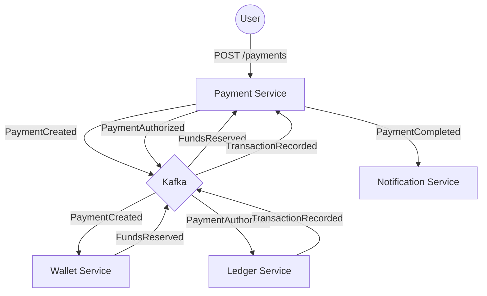

# Event-Driven Payments Platform


**A backend engineering portfolio project demonstrating distributed payment processing architecture.**

This system simulates the engineering patterns required to move money reliably across multiple services that cannot share a single database transaction — choreography-based sagas, idempotent event processing, and compensating transactions for automatic failure recovery.

## What This Project Demonstrates

This project showcases enterprise-grade backend engineering skills:

- **Distributed Systems Design** — Microservices communicating asynchronously via events, not direct API calls
- **Saga Pattern** — Coordinating multi-step transactions across independent services with automatic rollback on failure
- **Fault Tolerance & Idempotency** — Handling crashes mid-payment, duplicate events, and network failures safely
- **Domain-Driven Design** — Clear bounded contexts (Payment, Wallet, Ledger, Notification) mirroring real business domains
- **Event-Driven Architecture** — Using Kafka for reliable, scalable message passing between services

## How the Payment Flow Works

When a user initiates a payment, the system executes a coordinated sequence:

1. **Reserve Funds** — The Wallet Service locks the sender's money (prevents double-spending)
2. **Record Transaction** — The Ledger Service writes an immutable double-entry record
3. **Complete Payment** — The Payment Service finalizes the state
4. **Notify User** — The Notification Service sends confirmation

If any step fails, **compensating transactions automatically reverse prior steps** (e.g., releasing reserved funds if ledger recording fails). This ensures data consistency without a single database transaction.

## Why This Project?

Payment processing is one of the hardest distributed systems problems:

- Money cannot be lost or created due to race conditions
- Services must agree on transaction state despite failures
- Duplicate requests must not charge users twice

This project demonstrates the same architectural patterns used at Stripe, Square, and major banks to process billions in transactions reliably.

## Architecture

The system uses a **choreography-based Saga pattern** where services react to events and emit their own events to trigger the next step.


```mermaid
graph TD
    User((User)) -->|POST /payments| P[Payment Service]
    P -->|PaymentCreated| K{Kafka}
    K -->|PaymentCreated| W[Wallet Service]
    W -->|FundsReserved| K
    K -->|FundsReserved| P
    P -->|PaymentAuthorized| K
    K -->|PaymentAuthorized| L[Ledger Service]
    L -->|TransactionRecorded| K
    K -->|TransactionRecorded| P
    P -->|PaymentCompleted| N[Notification Service]
```

## Services

| Service | Responsibility |
|---------|---------------|
| **Payment Service** | Orchestrates the payment lifecycle and state machine |
| **Wallet Service** | Manages user balances and fund reservations |
| **Ledger Service** | Immutable double-entry ledger for audit trails |
| **Notification Service** | Sends alerts based on payment events |

## Technology Stack

- **Java 17** with Spring Boot 3.2
- **Apache Kafka** for event streaming
- **PostgreSQL** per service (isolated data ownership)
- **Docker Compose** for local deployment
- **Maven** for build management

## Prerequisites

- Java 17+
- Docker & Docker Compose
- Maven 3.8+

## How to Run

1. **Clone the repository**
   ```bash
   git clone https://github.com/yourusername/event-driven-payments.git
   cd event-driven-payments
   ```

2. **Start Infrastructure & Services**
   ```bash
   docker-compose up -d --build
   ```

3. **Access APIs**
   - **Payment Service**: http://localhost:8080/swagger-ui/index.html
   - **Wallet Service**: http://localhost:8081/swagger-ui/index.html
   - **Ledger Service**: http://localhost:8082/swagger-ui/index.html
   - **Notification Service**: http://localhost:8083/swagger-ui/index.html

## Demo

Run the included script to see the full payment lifecycle:

```bash
./demo_script.sh
```

This script will:
1. Check if services are healthy
2. Create a payment
3. Poll until the Saga completes (payment reaches `COMPLETED` state)

## API Usage

### Create a Payment

```bash
curl -X POST http://localhost:8080/payments \
  -H "Content-Type: application/json" \
  -d '{
    "amount": 100.00,
    "currency": "USD",
    "debitorId": "user-123",
    "beneficiaryId": "merchant-456"
  }'
```

### Check Payment Status

```bash
curl http://localhost:8080/payments/{paymentId}
```
