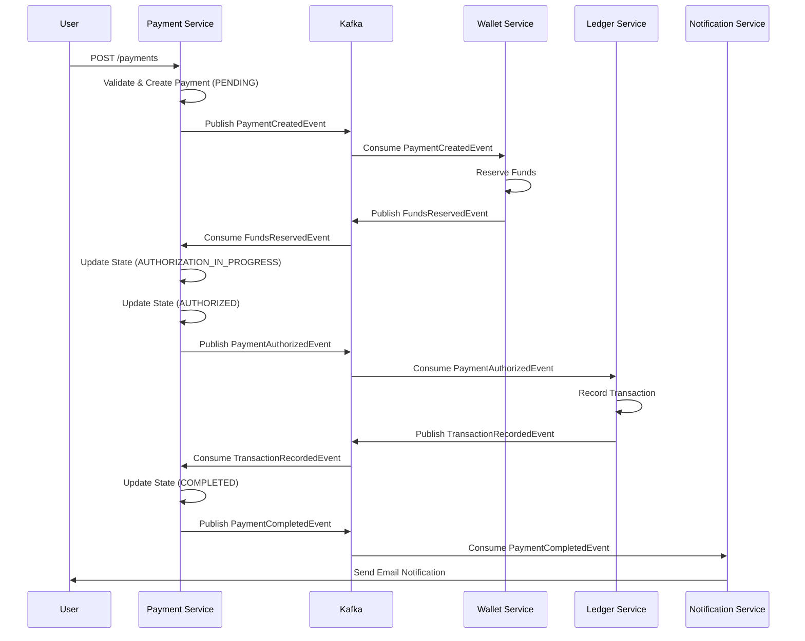

# Architecture

## Domain Driven Design
The project is split into bounded contexts:
- Payment
- Wallet
- Ledger
- Notification

### Code Sharing Strategy
**Shared infrastructure** (common module):
- `ProcessedEvent`: Idempotency tracking
- Build-time dependency only

**Separate domain logic** (per service):
- Entities, repositories, services
- Event schemas (duplicated for autonomy)

This hybrid approach preserves bounded context independence while reducing infrastructure duplication.

## Event Driven
We use Kafka for async communication.
- `payments.lifecycle`: Key topic for payment state changes.

## Saga Flow
The following sequence diagram illustrates the choreography-based Saga pattern used in this project:

## State Machine
Payment States:
- CREATED
- FUNDS_RESERVED
- AUTHORIZATION_IN_PROGRESS
- AUTHORIZED
- COMPLETED
- FAILED
- CANCELLED
- EXPIRED

Transitions are enforced by `PaymentStateTransitionService`.

## Failure Handling & Compensating Transactions

The system implements **compensating transactions** to handle failures at each step of the Saga:

### Failure Scenarios

| Scenario | Trigger | Compensating Action |
| :--- | :--- | :--- |
| **Insufficient Funds** | Wallet cannot reserve funds | Emit `FundsReservationFailedEvent` → Payment transitions to `FAILED` |
| **Ledger Failure** | Ledger fails to record transaction | Emit `PaymentCancelledEvent` → Wallet releases reserved funds |
| **User Cancellation** | Payment cancelled after reservation | Emit `PaymentCancelledEvent` → Wallet releases funds |

### Key State Transitions for Failure
- `CREATED` → `FAILED` (if funds reservation fails)
- `AUTHORIZATION_IN_PROGRESS` → `FAILED` (if authorization logic fails)
- `FUNDS_RESERVED` → `CANCELLED` (user-initiated cancellation)
