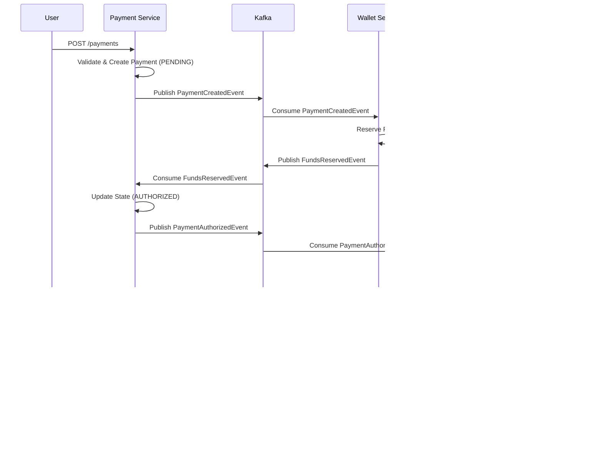

# Architecture

## Domain Driven Design
The project is split into bounded contexts:
- Payment
- Wallet
- Ledger
- Notification

## Event Driven
We use Kafka for async communication.
- `payments.lifecycle`: Key topic for payment state changes.

## Saga Flow
The following sequence diagram illustrates the choreography-based Saga pattern used in this project:


```mermaid
sequenceDiagram
    participant U as User
    participant P as Payment Service
    participant K as Kafka
    participant W as Wallet Service
    participant L as Ledger Service
    participant N as Notification Service

    U->>P: POST /payments
    P->>P: Validate & Create Payment (PENDING)
    P->>K: Publish PaymentCreatedEvent
    K->>W: Consume PaymentCreatedEvent
    W->>W: Reserve Funds
    W->>K: Publish FundsReservedEvent
    K->>P: Consume FundsReservedEvent
    P->>P: Update State (AUTHORIZED)
    P->>K: Publish PaymentAuthorizedEvent
    K->>L: Consume PaymentAuthorizedEvent
    L->>L: Record Transaction
    L->>K: Publish TransactionRecordedEvent
    K->>P: Consume TransactionRecordedEvent
    P->>P: Update State (COMPLETED)
    P->>K: Publish PaymentCompletedEvent
    K->>N: Consume PaymentCompletedEvent
    N->>U: Send Email Notification
```

## State Machine
Payment States:
- CREATED
- FUNDS_RESERVED
- AUTHORIZATION_IN_PROGRESS
- AUTHORIZED
- COMPLETED
- FAILED
- CANCELLED
- EXPIRED

Transitions are enforced by `PaymentStateTransitionService`.

## Compensation and Failure Flows

### Insufficient Funds Flow
When the Wallet Service cannot reserve funds due to insufficient balance:

```
PaymentCreatedEvent -> WalletService attempts to reserve funds 
  -> InsufficientFundsEvent emitted 
  -> PaymentService transitions payment to FAILED 
  -> PaymentFailedEvent emitted 
  -> NotificationService sends failure notification
```

### Mid-Saga Failure and Compensation
When any service fails mid-saga, compensation events trigger rollback of prior steps:

1. **If Ledger fails after Wallet reserved funds**:
   ```
   FundsReservedEvent -> LedgerService attempts to record 
     -> LedgerFailedEvent emitted 
     -> WalletService releases reserved funds (compensation) 
     -> PaymentService transitions to FAILED
   ```

2. **Compensation Actions**:
   - `releaseFunds`: WalletService releases previously reserved funds
   - `reverseTransaction`: LedgerService reverses recorded entries (if applicable)
   - `cancelPayment`: PaymentService transitions to CANCELLED/FAILED state

## Full Saga Event Flow

### Success Path
```
PaymentCreatedEvent 
  -> WalletService reserves funds 
  -> FundsReservedEvent 
  -> LedgerService records entry 
  -> TransactionRecordedEvent 
  -> PaymentService completes payment 
  -> PaymentCompletedEvent 
  -> NotificationService sends success notification
```

### Failure Path
```
PaymentCreatedEvent 
  -> WalletService has insufficient funds 
  -> InsufficientFundsEvent 
  -> PaymentService transitions to FAILED 
  -> PaymentFailedEvent 
  -> NotificationService sends failure notification
```

